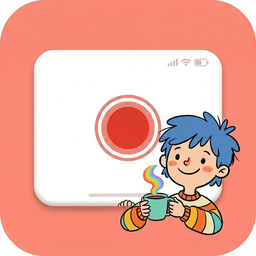

<p align="center">
  
</p>

<h1 align="center">ScreenCut 屏幕剪辑</h1>

<p align="center">精致录屏，轻松创作</p>

<p align="center">
  <a href="https://github.com/lhfer/openscreen/releases">下载最新版</a> ·
  <a href="https://www.xiaohongshu.com/user/profile/651465e9000000002402f600">反馈问题</a> ·
  <a href="https://github.com/siddharthvaddem/openscreen">上游项目</a>
</p>

---

## 关于

ScreenCut 是一款面向中文用户的 macOS 屏幕录制与编辑工具，类似 [Screen Studio](https://screen.studio/) 的开源平替方案。

本项目基于 **[OpenScreen](https://github.com/siddharthvaddem/openscreen)** 开源项目进行中文本土化与定制开发。衷心感谢 OpenScreen 团队的出色工作和开源精神 —— 我们只是站在巨人肩膀上的小小改造工。

## 功能特性

- 🎬 屏幕 / 窗口 / 区域录制
- 🔍 智能缩放（自动跟随光标）
- ✂️ 时间轴裁剪与变速
- 🎨 背景美化（壁纸 / 纯色 / 渐变）
- 💫 动感模糊 + 阴影 + 圆角效果
- 📝 文字 / 图片 / 箭头标注
- 📹 摄像头画中画
- 📦 导出 MP4 / GIF

## 本地化改动

在 OpenScreen 基础上的改动：

- 🇨🇳 完全中文本土化：所有界面文案、菜单、提示信息
- 🎨 品牌配色定制
- 🖼️ 自定义应用图标
- 🍎 macOS 原生菜单栏中文化
- ⌨️ 快捷键面板中文化
- 🐛 裁剪指南 i18n 修复
- 📱 源选择窗口拖拽支持
- ✨ 导出体验优化

## 安装

前往 **[Releases](https://github.com/lhfer/openscreen/releases)** 下载最新的 DMG 安装包。

> 首次打开需要在「系统设置 → 隐私与安全性 → 屏幕录制」中授权。

## 开发

```bash
npm install     # 安装依赖
npm run dev     # 开发模式
npm run build:mac  # 构建 macOS 应用
```

## 反馈

使用中遇到问题或有建议，欢迎联系：

- 📕 [小红书](https://www.xiaohongshu.com/user/profile/651465e9000000002402f600)
- 🐛 [GitHub Issues](https://github.com/lhfer/openscreen/issues)

## 致谢

- **[OpenScreen](https://github.com/siddharthvaddem/openscreen)** — 本项目的上游开源项目，MIT License
- **[Screen Studio](https://screen.studio/)** — 产品灵感来源

## 许可证

[MIT License](LICENSE) — 与上游 OpenScreen 项目保持一致。
